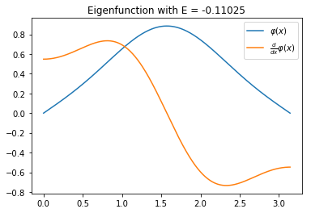
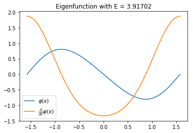
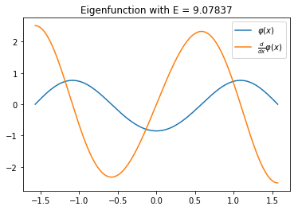
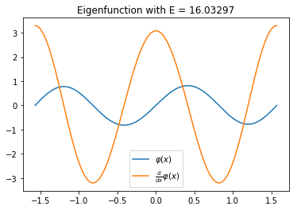
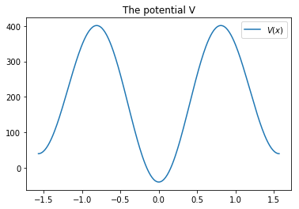

Using PySlise
#############

Mathieu problem
***************

The Mathieu problem is given as:
Find eigenfunctions :math:`\varphi` and eigenvalue :math:`E` for which

.. math::
  \frac{d}{dx}\varphi(x) + (E-2\cos(2x))\varphi(x) = 0

on :math:`[-\frac{\pi}{2}, \frac{\pi}{2}]`. The boundary conditions are: :math:`\varphi(-\frac{\pi}{2}) = \varphi(\frac{\pi}{2}) = 0`.

This can be transformed to a Schrödinger equation with :math:`V(x) = 2\cos(2x)`. Solving this equation with PySlise is fairly easy:

.. code:: python

  from pyslise import PySlise
  from math import pi, cos

  problem = PySlise(lambda x: 2*cos(2*x),
                    -pi/2, pi/2, tolerance=1e-5)
  left = (0, 1)
  right = (0, 1)
  eigenvalues = problem.computeEigenvaluesByIndex(
      0, 10, left, right)

The variable ``eigenvalues`` contains a list of tuples. Each tuples has as the first element the index of the eigenvalue and as second argument the eigenvalue itself. This example is a minimal example of how to use PySlise.

One could go further and ask for an estimation of the error for each eigenvalue. This data can be formatted in a nice table:

.. code:: python

  print('index  eigenvalue     error')
  for index, E in eigenvalues:
      error = problem.computeEigenvalueError(E, left, right)
      print(f'{index:>5} {E:>11.5f} {error:>9.1e}')

===== =========== =======
index  eigenvalue   error
===== =========== =======
    0     1.85911 1.9e-08
    1     3.91702 2.2e-08
    2     9.07837 2.8e-08
    3    16.03297 7.5e-08
    4    25.02085 6.2e-08
    5    36.01429 3.2e-09
    6    49.01042 2.7e-08
    7    64.00794 4.2e-09
    8    81.00625 2.2e-08
    9   100.00505 1.7e-08
===== =========== =======

Depending on the version of PySlise or Python, or difference in hardware, your results may differ slightly.

Eigenfunctions
^^^^^^^^^^^^^^
With matplotlib it is straightforward to make a plot of the eigenvalues. The syntax is similar to MATLAB's.

.. code:: python

  import numpy
  import matplotlib.pyplot as plt

  xs = numpy.linspace(-pi/2, pi/2, 300)
  for index, E in eigenvalues:
      phi, d_phi = problem.computeEigenfunction(E, left, right, xs)

      plt.figure()
      plt.title(f'Eigenfunction with E = {E:.5f}')
      plt.plot(xs, phi, xs, d_phi)
      plt.legend(['$\\varphi(x)$', '$\\frac{d}{dx}\\varphi(x)$'])
      plt.show()

Coffey-Evans
***************

The Coffey Evans problem is given by the potential:

.. math::
  V(x) = -2\beta\cos(2 x)+\beta^2\sin(2 x)^2

and the domain :math:`[-\frac{\pi}{2}, \frac{\pi}{2}]` with Dirichlet zero boundary conditions.

It is well known as a hard problem, because there are triplets of close eigenvalues. On the other hand, the problem is symmetric and a few optimizations can be made. PySlise implements this as ``PySliseHalf``, indicating only half of the domain will be used, because of the symmetry.

.. code:: python

  from pyslise import PySliseHalf
  from math import pi, cos, sin

  B = 20
  problem = PySliseHalf(lambda x: -2*B*cos(2*x)+B**2*sin(2*x)**2,
                        pi/2, tolerance=1e-5)
  side = (0, 1)
  eigenvalues = problem.computeEigenvaluesByIndex(0, 10, side)
  for i, E in eigenvalues:
      print(f'{i:3} {E:>10.6f}')

===== ==========
Index Eigenvalue
===== ==========
    0  -0.000000
    1  77.916196
    2 151.462778
    3 151.463224
    4 151.463669
    5 220.154230
    6 283.094815
    7 283.250744
    8 283.408735
    9 339.370666
===== ==========

Adapting the code for plotting, the first triplet of close eigenvalues can be visualized. For completeness, also the potential itself is plotted.

.. code:: python

  import numpy
  import matplotlib.pyplot as plt

  xs = numpy.linspace(-pi/2, pi/2, 300)

  plt.figure()
  plt.title(f'The potential V')
  plt.plot(xs, list(map(V, xs)))
  plt.legend(['$V(x)$'])
  plt.show()

  for index, E in eigenvalues:
      phi, d_phi = problem.computeEigenfunction(E, side, xs)

      plt.figure()
      plt.title(f'Eigenfunction with E = {E:.5f}')
      plt.plot(xs, phi)
      plt.legend(['$\\varphi(x)$'])
      plt.show()

.. image:: images/coffey2.png
    :width: 49 %

.. image:: images/coffey3.png
    :width: 49 %
.. image:: images/coffey4.png
    :width: 49 %
