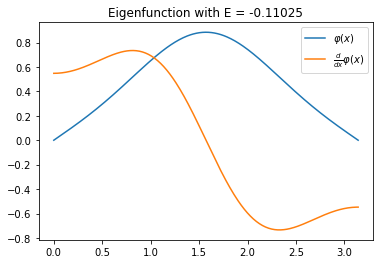
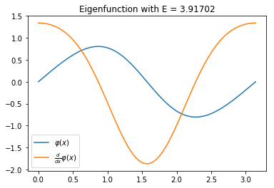
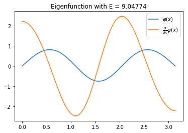
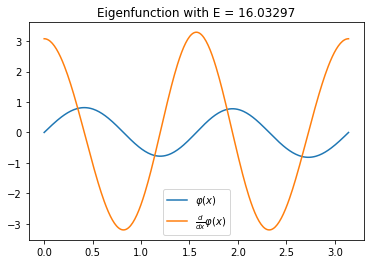

Mathieu problem
***************

..  contents::
    :local:
    :backlinks: top

The Mathieu problem is given as:
Find eigenfunctions :math:`\varphi` and eigenvalue :math:`E` for which

.. math::
  \frac{d^2}{dx^2}\varphi(x) + (E-2\cos(2x))\varphi(x) = 0

on :math:`[0, \pi]`. The boundary conditions are:
:math:`\varphi(0) = \varphi(\pi) = 0`.

This can be transformed to a Schrödinger equation with
:math:`V(x) = 2\cos(2x)`. Solving this equation with PySlise is fairly easy:

.. code:: python

  from pyslise import Pyslise
  from math import pi, cos

  problem = Pyslise(lambda x: 2*cos(2*x), 0, pi, tolerance=1e-5)
  left = (0, 1)
  right = (0, 1)
  eigenvalues = problem.eigenvaluesByIndex(0, 10, left, right)

The variable ``eigenvalues`` contains a list of tuples. Each tuple has as
the first element the index of the eigenvalue and as second argument the
eigenvalue itself. This example is a minimal example of how to use PySlise.

One could go further and ask for an estimation of the error for each
eigenvalue. This data can be formatted in a nice table:

.. code:: python

  print('index  eigenvalue     error')
  for index, E in eigenvalues:
      error = problem.eigenvalueError(E, left, right)
      print(f'{index:>5} {E:>11.5f} {error:>9.1e}')

===== =========== =======
index  eigenvalue   error
===== =========== =======
    0    -0.11025 6.3e-08
    1     3.91702 1.2e-08
    2     9.04774 2.9e-08
    3    16.03297 2.6e-09
    4    25.02084 1.3e-07
    5    36.01429 6.5e-09
    6    49.01042 1.2e-07
    7    64.00794 5.0e-08
    8    81.00625 4.5e-08
    9   100.00505 2.4e-08
===== =========== =======

Depending on the version of PySlise or Python, or difference in hardware,
your results may differ slightly.

Eigenfunctions
^^^^^^^^^^^^^^
With matplotlib it is straightforward to make a plot of the eigenfunctions.
The syntax is similar to MATLAB's.

.. code:: python

  import numpy
  import matplotlib.pyplot as plt

  xs = numpy.linspace(0, pi, 300)
  for index, E in eigenvalues:
      phi, d_phi = problem.eigenfunction(E, left, right)(xs)

      plt.figure()
      plt.title(f'Eigenfunction with E = {E:.5f}')
      plt.plot(xs, phi, xs, d_phi)
      plt.legend(['$\\varphi(x)$', '$\\frac{d}{dx}\\varphi(x)$'])
      plt.show()

