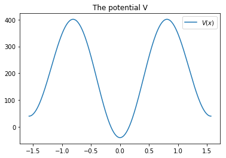
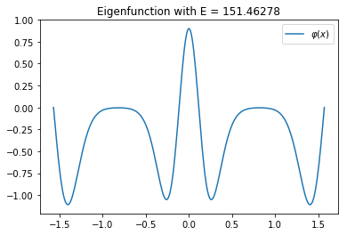
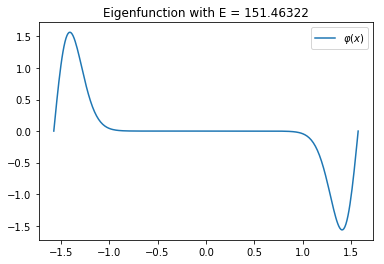
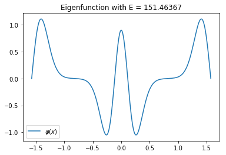

Coffey-Evans
***************

..  contents::
    :local:
    :backlinks: top

The Coffey Evans problem is given by the potential:

.. math::
  V(x) = -2\beta\cos(2 x)+\beta^2\sin(2 x)^2

and the domain :math:`[-\frac{\pi}{2}, \frac{\pi}{2}]` with
Dirichlet boundary conditions.

For rising :math:`\beta`, it is a well known hard problem, because there are
triplets of close eigenvalues. On the other hand, the problem is symmetric and
a few optimizations can be made. Pyslise implements this as ``PysliseHalf``,
indicating half range reduction is applied, because of the symmetry.

.. code:: python

  from pyslise import PysliseHalf
  from math import pi, cos, sin

  B = 20
  V = lambda x: -2*B*cos(2*x)+B**2*sin(2*x)**2
                         
  problem = PysliseHalf(V, pi/2, tolerance=1e-5)
  side = (0, 1)
  eigenvalues = problem.eigenvaluesByIndex(0, 10, side)
  for i, E in eigenvalues:
      print(f'{i:3} {E:>10.6f}')

===== ==========
Index Eigenvalue
===== ==========
    0  -0.000000
    1  77.916196
    2 151.462778
    3 151.463224
    4 151.463669
    5 220.154230
    6 283.094815
    7 283.250744
    8 283.408735
    9 339.370666
===== ==========

Adapting the code for plotting, the first triplet of close eigenvalues
can be visualized. For completeness, also the potential itself is plotted.

.. code:: python

  import numpy
  import matplotlib.pyplot as plt

  xs = numpy.linspace(-pi/2, pi/2, 300)

  plt.figure()
  plt.title(f'The potential V')
  plt.plot(xs, list(map(V, xs)))
  plt.legend(['$V(x)$'])
  plt.show()

  for index, E in eigenvalues:
      phi, d_phi = problem.eigenfunction(E, side)(xs)

      plt.figure()
      plt.title(f'Eigenfunction with E = {E:.5f}')
      plt.plot(xs, phi)
      plt.legend(['$\\varphi(x)$'])
      plt.show()

